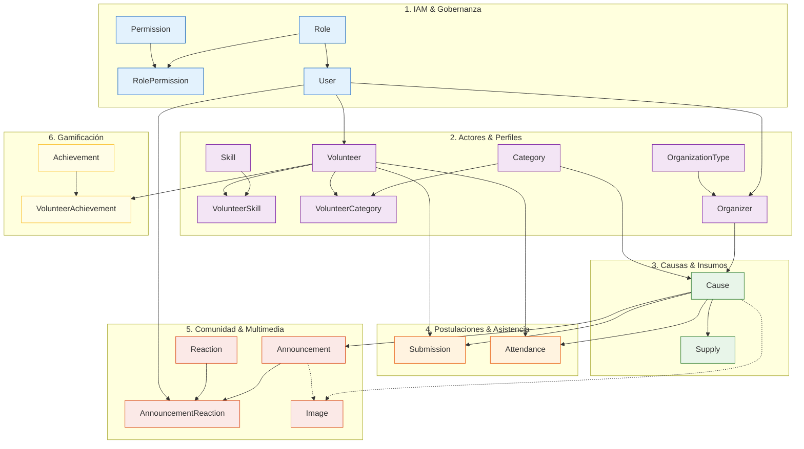

# Guía de Flujo de Trabajo, Ramas y Distribución de Historias (Jira)

Este documento detalla la **estrategia de ramas**, el **mapeo de las 56 historias de usuario de Jira** entre los 3 integrantes del equipo y el **protocolo de integración continua** para el backend de **Kindly App**.

---

## 1. Visión General y Dominios de la Aplicación

Kindly es una plataforma de voluntariado construida en **NestJS**, **TypeORM** y **PostgreSQL**, con un modelo de datos estructurado en 21 entidades y 6 dominios operativos:



---

## 2. Estrategia de Ramificación (Git Flow)

Para garantizar un repositorio limpio, modular y sin conflictos (*merge conflicts*):

* **`main`**: Rama de producción y versiones desplegables. **Protegida** (nunca hacer push o commit directo).
* **`develop`**: Rama base para el desarrollo diario. Toda funcionalidad se desprende y se integra aquí.
* **`feat/<nombre-en-kebab-case>`**: Ramas de trabajo de corta duración asignadas a cada desarrollador.
* **`release/vX.Y.Z`**: Rama temporal para estabilización, pruebas finales de integración y generación de versión.
* **`hotfix/<nombre>`**: Correcciones críticas urgentes originadas directamente desde `main`.

---

## 3. Asignación de Ramas por Persona (56 Historias de Jira)

Cada desarrollador tiene asignadas **3 a 4 ramas temáticas y cohesivas**. Esto evita la saturación de micro-ramas y elimina las dependencias circulares.

### 👤 Persona 1 — Usuarios, Perfiles, Admin y Búsqueda (19 Historias)

| Rama | Historias de Jira | Módulos y Entidades | Commits Semánticos Clave |
| :--- | :--- | :--- | :--- |
| **`feat/auth-and-user-governance`** | • `US-1.1.1` Register an account<br>• `US-1.1.2` Authenticate with email/password<br>• `US-1.1.3` Maintain account status<br>• `US-1.5.1` View and manage users<br>• `US-1.5.3` Manage roles<br>• `US-1.5.4` Manage permissions | `auth/`, `users/`<br>*(User, Role, Permission, RolePermission)* | `feat(auth): add register and login jwt endpoints`<br>`feat(auth): implement roles and permissions guards`<br>`feat(users): add user management and status toggle` |
| **`feat/volunteer-profiles-and-achievements`** | • `US-1.2.1` Manage volunteer personal profile<br>• `US-1.2.2` Manage volunteer interest categories<br>• `US-1.2.3` Manage volunteer skills<br>• `US-1.2.4` Manage volunteer field readiness info<br>• `US-1.2.5` View volunteer activity<br>• `US-1.3.1` View available achievements<br>• `US-1.3.2` View earned achievements | `volunteers/`, `achievements/`<br>*(Volunteer, Skill, Category, VolunteerSkill, VolunteerCategory, Achievement)* | `feat(volunteers): implement profile setup and readiness data`<br>`feat(volunteers): handle volunteer skills and categories`<br>`feat(achievements): list available and earned badges` |
| **`feat/organization-profiles-verification`** | • `US-1.4.1` Manage organization profile<br>• `US-1.4.2` Submit organization verification document<br>• `US-1.4.3` View organization verification status<br>• `US-1.5.2` Review organization verification | `organizations/`<br>*(Organizer, OrganizationType)* | `feat(organizations): add organization profile management`<br>`feat(organizations): implement verification doc upload and admin review` |
| **`feat/causes-search-and-filters`** | • `US-3.3.1` Search causes by keywords<br>• `US-3.3.2` Filter causes by category | `causes/`, `volunteers/`<br>*(Cause, Category)* | `feat(causes): implement keyword search query`<br>`feat(causes): add category multi-filter endpoint` |

---

### 👤 Persona 2 — Gestión de Causas + Match y Mapa (19 Historias)

| Rama | Historias de Jira | Módulos y Entidades | Commits Semánticos Clave |
| :--- | :--- | :--- | :--- |
| **`feat/causes-crud-and-supplies`** | • `US-2.1.1` Create a cause<br>• `US-2.1.2` Manage cause supplies<br>• `US-2.1.3` Manage cause images<br>• `US-2.1.4` Publish and make cause available<br>• `US-2.2.1` View my causes<br>• `US-2.2.2` Edit cause information<br>• `US-2.2.3` Monitor cause capacity<br>• `US-2.2.4` Manage cause availability<br>• `US-2.2.5` Manage cause progress<br>• `US-2.2.6` Manage cause supplies and images | `causes/`, `media/`<br>*(Cause, Supply, Image)* | `feat(causes): implement cause publishing and quota management`<br>`feat(supplies): add supply checklist management for events`<br>`feat(causes): add availability and progress state transitions` |
| **`feat/announcements-and-reactions`** | • `US-2.3.1` Create cause announcements<br>• `US-2.3.2` Add images to announcements<br>• `US-2.3.3` Like announcements | `announcements/`, `media/`<br>*(Announcement, Reaction, AnnouncementReaction, Image)* | `feat(announcements): create cause broadcast announcement channel`<br>`feat(announcements): add reactions and likes system` |
| **`feat/swipe-match-deck`** | • `US-3.1.1` Browse causes with swipe cards<br>• `US-3.1.2` View cause info on cards<br>• `US-3.1.3` Match with a cause<br>• `US-3.1.4` Dismiss a cause | `matches/`<br>*(MatchesService)* | `feat(matches): create card deck discovery feed`<br>`feat(matches): add match and dismiss action endpoints` |
| **`feat/causes-map-preview`** | • `US-3.2.1` View causes on an interactive map<br>• `US-3.2.2` Open cause preview from map | `matches/`, `causes/`<br>*(Cause, Geolocation)* | `feat(matches): return geolocated active causes pins`<br>`feat(matches): add quick preview summary card by cause id` |

---

### 👤 Persona 3 — Postulaciones + QR y Asistencia (18 Historias)

| Rama | Historias de Jira | Módulos y Entidades | Commits Semánticos Clave |
| :--- | :--- | :--- | :--- |
| **`feat/application-pipeline-screening`** | • `US-4.1.1` Submit a cause application<br>• `US-4.1.2` Provide application justification<br>• `US-4.1.3` View application status<br>• `US-4.1.4` View application details and dates<br>• `US-4.2.1` View cause applicants<br>• `US-4.2.2` View applicant profile<br>• `US-4.2.3` View applicant justification<br>• `US-4.2.4` Accept an applicant<br>• `US-4.2.5` Reject an applicant<br>• `US-4.2.6` Enforce cause capacity | `participations/`<br>*(Submission, Cause, Volunteer)* | `feat(participations): implement volunteer application with supplies commitment`<br>`feat(participations): add organizer screening queue with approve/reject actions`<br>`feat(participations): enforce quota capacity validation on acceptance` |
| **`feat/attendance-qr-checkin`** | • `US-4.3.1` Display cause QR code<br>• `US-4.3.2` Scan event QR code<br>• `US-4.3.3` Validate accepted status for check-in<br>• `US-4.3.4` Register attendance<br>• `US-4.3.5` Prevent duplicate attendance<br>• `US-4.3.6` Update completed causes after attendance | `participations/`, `volunteers/`<br>*(Attendance, Submission, Volunteer)* | `feat(participations): generate unique event qr code for organizers`<br>`feat(participations): validate qr checkin and record attendance timestamp`<br>`feat(volunteers): increment completed causes counter on successful checkin` |
| **`feat/for-you-feed-and-map-navigation`** | • `US-3.2.3` Navigate the cause map<br>• `US-3.3.3` View the For You feed | `matches/`<br>*(MatchesService, Geolocation)* | `feat(matches): calculate interest affinity score for 'For You' feed`<br>`feat(matches): implement map boundary and radius navigation query` |

---

## 4. Secuencia de Integración y Dependencias (Cronograma de 8 Días)

Para completar el desarrollo de las 56 historias en **8 días** sin bloqueos entre integrantes:

```text
┌────────────────────────────────────────────────────────────────────────────────────────┐
│ DÍAS 1 - 2: NÚCLEO, AUTENTICACIÓN Y CAUSAS BASE                                        │
│ • Persona 1 -> feat/auth-and-user-governance (Desbloquea Auth, JWT, Guards y Admin)    │
│ • Persona 2 -> feat/causes-crud-and-supplies (Desbloquea Causas e Insumos)             │
│ • Persona 3 -> Prepara estructura base y DTOs de Participations                       │
│ ──> MERGE A DEVELOP (Final Día 2)                                                      │
├────────────────────────────────────────────────────────────────────────────────────────┤
│ DÍAS 3 - 4: PERFILES, POSTULACIONES Y ANUNCIOS                                         │
│ • Persona 1 -> feat/volunteer-profiles-and-achievements (Perfiles y Logros)            │
│ • Persona 2 -> feat/announcements-and-reactions (Anuncios y Reacciones)                │
│ • Persona 3 -> feat/application-pipeline-screening (Usa Causas de P2 y Auth de P1)     │
│ ──> MERGE A DEVELOP (Final Día 4)                                                      │
├────────────────────────────────────────────────────────────────────────────────────────┤
│ DÍAS 5 - 6: ASISTENCIA QR, VERIFICACIÓN Y MATCH CARDS                                  │
│ • Persona 1 -> feat/organization-profiles-verification (Docs legales y revisión)       │
│ • Persona 2 -> feat/swipe-match-deck (Feed swipe cards de descubrimiento)             │
│ • Persona 3 -> feat/attendance-qr-checkin (Generación QR y validación de check-in)     │
│ ──> MERGE A DEVELOP (Final Día 6)                                                      │
├────────────────────────────────────────────────────────────────────────────────────────┤
│ DÍA 7: BÚSQUEDA MULTICRITERIO, MAPAS Y FEED "PARA TI"                                  │
│ • Persona 1 -> feat/causes-search-and-filters (Keywords y filtro categorías)           │
│ • Persona 2 -> feat/causes-map-preview (Pins geolocalizados y modal preview)           │
│ • Persona 3 -> feat/for-you-feed-and-map-navigation (Feed afinidad y límites mapa)     │
│ ──> MERGE A DEVELOP (Final Día 7)                                                      │
├────────────────────────────────────────────────────────────────────────────────────────┤
│ DÍA 8: ESTABILIZACIÓN, PRUEBAS INTEGRALES E2E Y RELEASE V1.0.0                         │
│ • Todo el equipo -> Pruebas de integración del flujo completo                          │
│ • Creación de rama release/v1.0.0 -> npm run lint && npm run test && npm run test:e2e  │
│ ──> MERGE A MAIN (Tag v1.0.0) Y SYNC FINAL A DEVELOP                                   │
└────────────────────────────────────────────────────────────────────────────────────────┘
```

---

## 5. Protocolo de Trabajo Diario Paso a Paso

### 1. Iniciar el día de trabajo
Siempre traer los últimos cambios integrados en `develop`:
```bash
git checkout develop
git pull origin develop
```

### 2. Crear o retomar tu rama de trabajo
```bash
git checkout -b feat/nombre-asignado
```

### 3. Realizar commits semánticos
Seguir el estándar [Conventional Commits v1.0.0](https://www.conventionalcommits.org/):
```bash
git add .
git commit -m "feat(participations): validate accepted status before qr checkin"
```

### 4. Verificación de calidad local antes de subir
Asegurar que no existan errores de compilación, linter o tests:
```bash
cd server
npm run lint
npm run test
cd ..
```

### 5. Subir la rama y abrir Pull Request
```bash
git push -u origin feat/nombre-asignado
```
* Abrir el PR hacia **`develop`** (nunca hacia `main`).
* Asignar a al menos un compañero del equipo como revisor.
* Al ser aprobado el PR, realizar **Squash & Merge** o **Merge Commit** según el estándar y eliminar la rama remota.

---

## 6. Manejo de Conflictos y Buenas Prácticas

1. **Si `develop` avanzó mientras trabajabas en tu rama**:
   Trae los cambios mediante rebase o merge limpio:
   ```bash
   git checkout develop
   git pull origin develop
   git checkout feat/mi-rama
   git merge develop
   # Resuelve conflictos si los hay, luego prueba:
   npm run lint
   npm run test
   ```
2. **Archivos compartidos sensibles**:
   * `app.module.ts`: Los módulos ya están registrados e importados. Evitar reordenamientos innecesarios para evitar conflictos de imports.
   * `common/`: Si requieres un nuevo pipe o excepción personalizada, expórtala en el barril `src/common/index.ts`.
